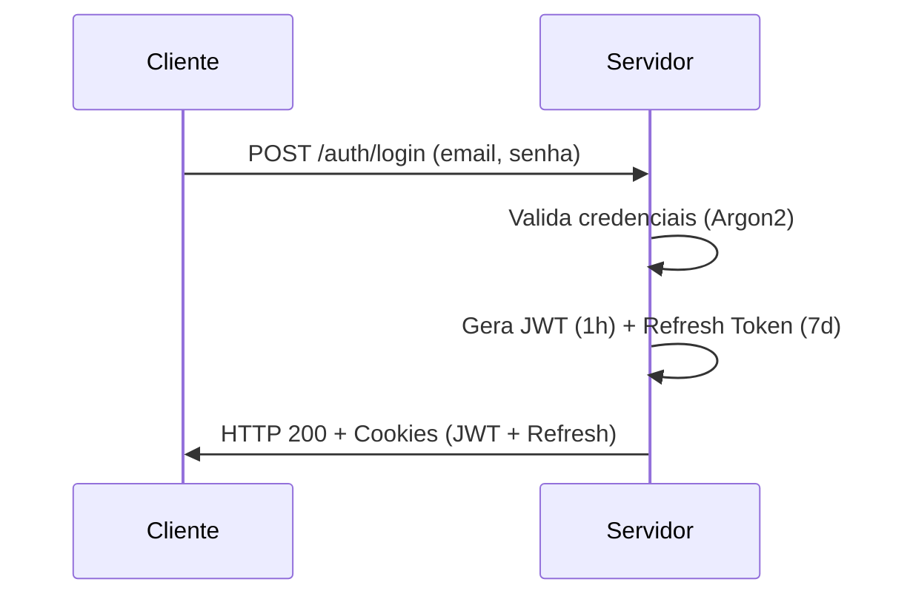
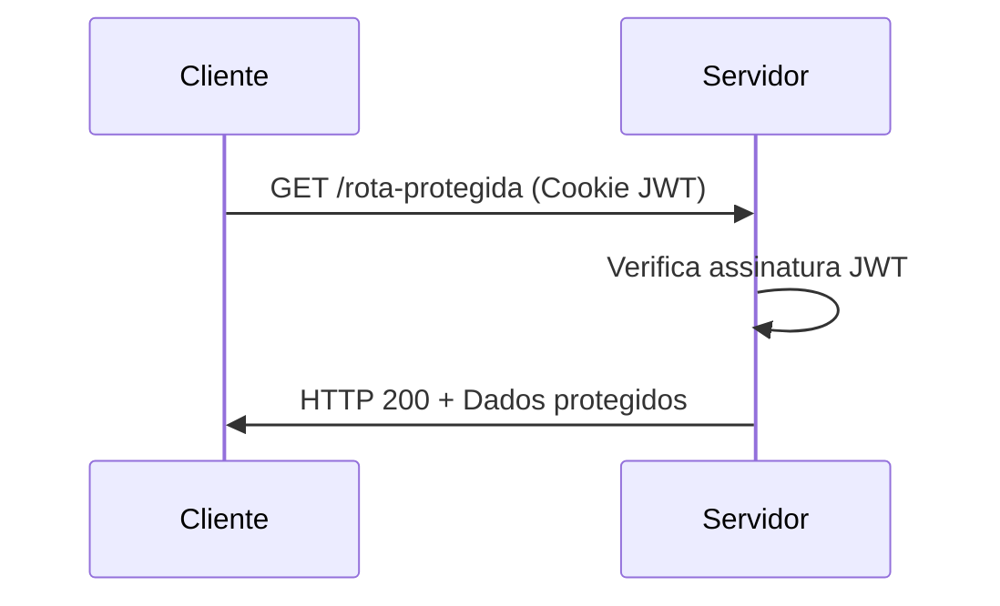
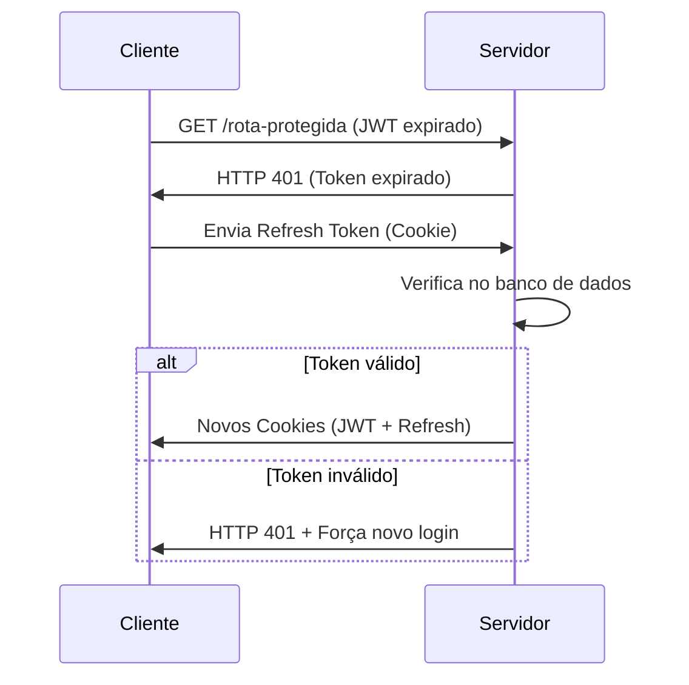

# 🔐 Auth API - NestJS + Prisma + JWT


API de autenticação segura com NestJS, Prisma e JWT, implementando refresh tokens e controle de acesso por roles.

## ✨ Funcionalidades

- **Autenticação JWT** com cookies HTTP-only
- **Refresh Tokens** seguros armazenados no banco
- **Controle de acesso** por roles (USER, ADMIN)
- **Validação de dados** com Zod
- **Hashing seguro** com Argon2
- **CRUD completo** de usuários
- **Prisma ORM** com PostgreSQL

## 🛠 Tecnologias

| Tecnologia       | Descrição                                  |
|------------------|-------------------------------------------|
| NestJS           | Framework para construção de APIs eficientes |
| Prisma           | ORM moderno para TypeScript/Node.js        |
| PostgreSQL       | Banco de dados relacional                 |
| Argon2           | Algoritmo de hashing para senhas          |
| Zod              | Validação de schemas TypeScript-first     |
| Passport.js      | Middleware de autenticação                |

## ⚙️ Configuração

1. Clone o repositório:
```bash
git clone https://github.com/piciliano/base-autentication.git
cd base-autentication
```
2. Instale as dependências:
```bash
npm install
```
3. Configure o ambiente:
```bash
cp .env.example .env
# Edite o .env com suas configurações
```
4. Execute as migrações do Prisma:
```bash
npx prisma migrate dev --name init
```
5. (Opcional) Popule o banco com dados iniciais:
```bash
npx prisma db seed
```
6. Execute em desenvolvimento:
```bash
npm run start:dev
```
### 1️⃣ Login Inicial (Geração dos Tokens)


### 2️⃣ Acesso com Token Válido


### 3️⃣ Renovação com Refresh Token

## 🔐 Detalhes da Implementação

### 🔑 Login
- Recebe email/senha
- Valida com Zod
- Verifica no banco (com Argon2)
- Gera:
  - JWT (1h de validade)
  - Refresh Token (7 dias)
- Armazena hash do refresh token no DB

### 🛡️ Acesso Protegido (com JWT + Refresh Token via Cookies)
- O guard verifica o JWT vindo no cookie
- Se estiver expirado, tenta usar o refresh token (também no cookie) para gerar um novo JWT
- O cookie é atualizado, mas só será enviado pelo navegador na próxima requisição
- Portanto, a primeira tentativa falha com 401, e o frontend deve tratar isso para evitar erro visível ao usuário

### 🚪 Logout
- Remove cookies
- (Opcional) Invalida refresh token no banco

## 🌐 Rotas da API

### 🔑 Autenticação (`/auth`)
| Método | Endpoint  | Body (JSON)           | Descrição               |
|--------|-----------|-----------------------|-------------------------|
| POST   | `/login`  | `{email, password}`   | Autentica usuário       |
| GET    | `/me`     | -                     | Dados do usuário atual  |
| POST   | `/logout` | -                     | Encerra sessão          |
| POST   | `/refresh`| -                     | Atualiza o token        |


### 👥 Usuários (`/user`)
| Método | Endpoint  | Body (JSON)           | Permissão | Descrição          |
|--------|-----------|-----------------------|-----------|--------------------|
| POST   | `/`       | `{email, name, pw}`   | Pública   | Cria novo usuário  |
| GET    | `/`       | -                     | Privada   | Lista usuários     |
| GET    | `/:id`    | -                     | Pública   | Busca por ID       |
| PATCH  | `/:id`    | `{email?, name?, pw?}`| Pública   | Atualiza usuário   |
| DELETE | `/:id`    | -                     | Pública   | Remove usuário     |

## 🛠 Fluxo rápido de como ocorre:

- O **JWT (Access Token)** é enviado em um cookie `httpOnly` chamado `jwt`.  
- O **Refresh Token** é armazenado em um cookie `httpOnly` chamado `refreshToken`, e seu valor contém:  
  `<refreshTokenId>:<refreshTokenRaw>`  
- Os tokens são gerados no login e renovados automaticamente via endpoint `/auth/refresh`.

---

## Renovação e Validação de Tokens

### Login (`POST /auth/login`)

- Verifica credenciais.  
- Remove todos os **refresh tokens antigos** do usuário.  
- Gera novos tokens:  
  - `jwt`: assinado com tempo curto (`JWT_EXPIRATION`).  
  - `refreshToken`: armazenado no banco com hash e expiração.  
- Ambos são enviados como cookies `httpOnly`.

### Refresh (`POST /auth/refresh`)

- Extrai o cookie `refreshToken` e separa ID e valor.  
- Busca o token no banco usando o ID.  
- Verifica a validade do token:  
  - Se expirado ou inexistente: rejeita.  
  - Se válido: deleta todos os anteriores e gera novos tokens.  
- Tokens atualizados são devolvidos como novos cookies.

### Logout (`POST /auth/logout`)

- Remove todos os refresh tokens associados ao usuário.  
- Limpa os cookies `jwt` e `refreshToken`.

---

## Limpeza de Tokens Expirados

Em **todas as rotas críticas** (login, refresh e logout), é executada a limpeza automática de tokens expirados com:

```ts
await this.prisma.refreshToken.deleteMany({
  where: { expiresAt: { lt: new Date() } },
});
```

## 📚 Documentação Adicional

- [Prisma Documentation](https://www.prisma.io/docs) - Guia completo do ORM
- [NestJS Security](https://docs.nestjs.com/security) - Melhores práticas de segurança
- [JWT Best Practices](https://curity.io/resources/learn/jwt-best-practices) - Padrões para autenticação JWT
- [Argon2 Documentation](https://github.com/ranisalt/node-argon2) - Implementação do algoritmo de hashing

---

## 👨‍💻 Autor

<div align="center">
  
  
  **Neto Vasconcelos**  
  🌐 [Portfólio](https://www.netodeveloper.com)  
  🔗 [LinkedIn](https://linkedin.com/in/picilianovasconcelos)  
</div>
